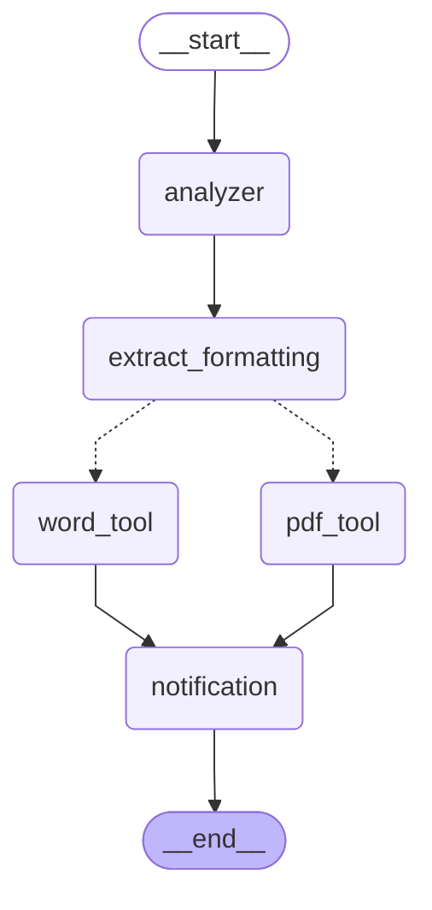

# StateGraph Visualization

This is the export workflow StateGraph:

## Workflow Description

1. **__start__** → Entry point
2. **analyzer** → Detects format (Word or PDF)
3. **extract_formatting** → Extracts styling preferences
4. **Router** → Conditional edge to Word or PDF tool
5. **word_tool** or **pdf_tool** → Generates document
6. **notification** → Opens file and logs success
7. **__end__** → Exit point

